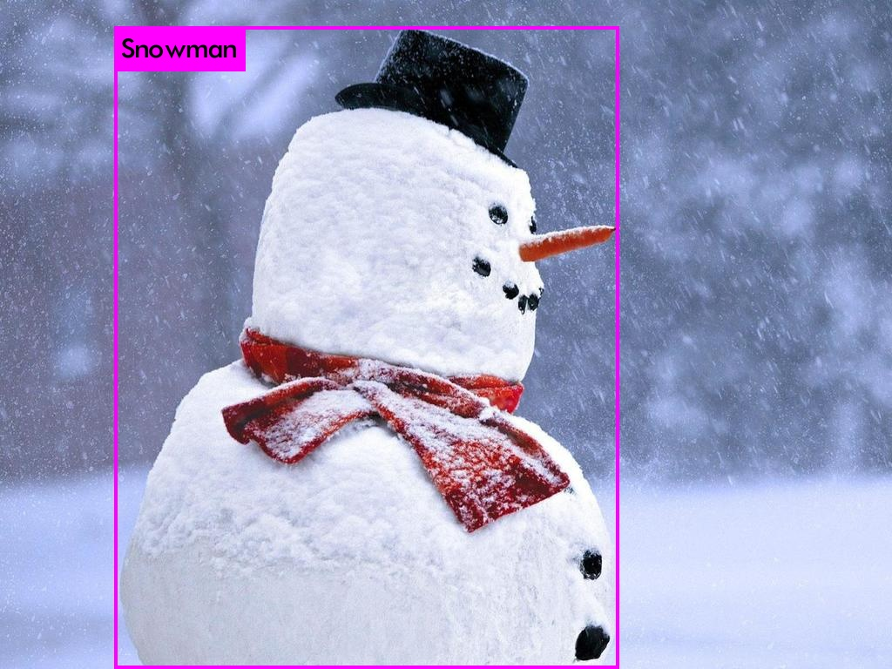
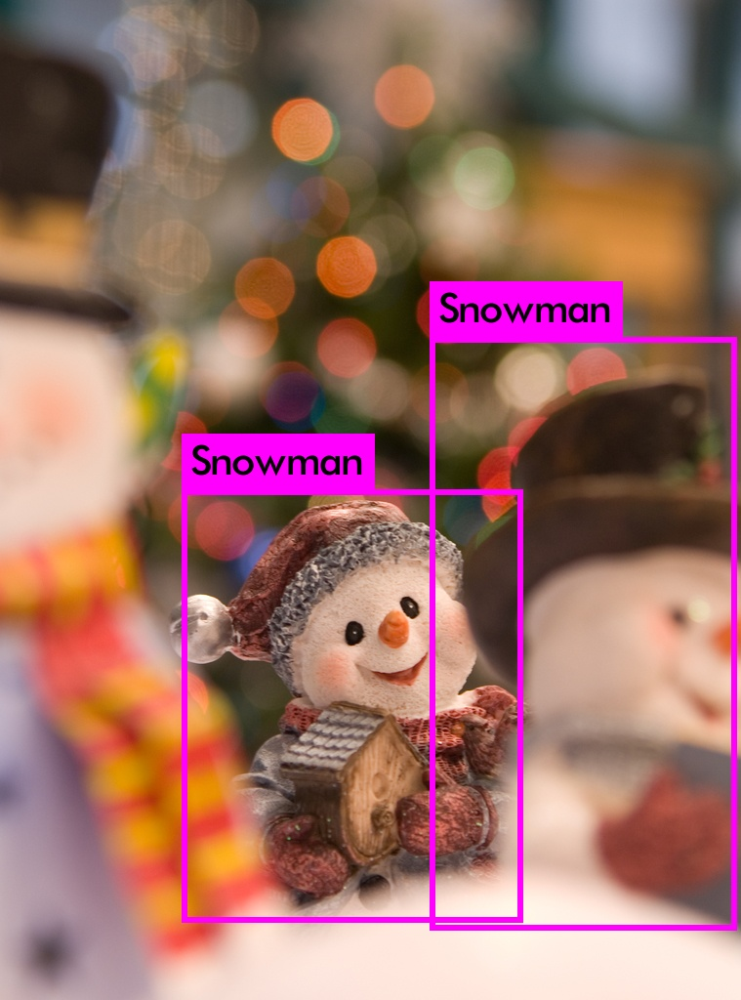
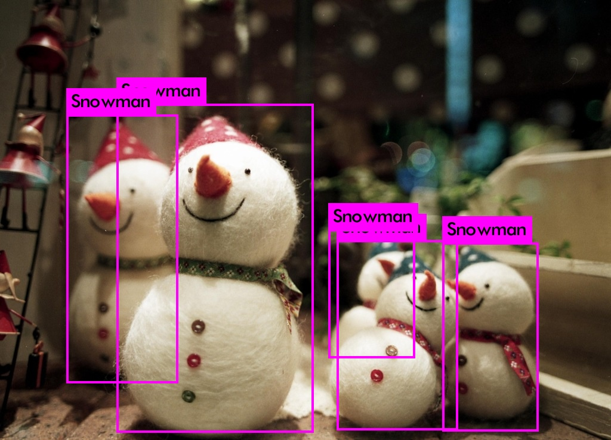

# Snowman Detection

* Step 0: Clone [YOLOv3 darknet](https://github.com/AlexeyAB/darknet)
* Step 1: Download:
>- Dataset: [link](https://drive.google.com/file/d/1ZyMcTy1yNLaK9tyj5cV0KcYej-DYwvh9/view?usp=sharing)
>- Model: [snowman weights - 121000 steps](./models/snowman.weights)
* Step 3: Run:
> * Train: you can train model again with Yolov3. Read more at [AlexeyAB](https://github.com/AlexeyAB/darknet)
> * Test: 
`./darknet detector test snowman.data snowman.cfg models/snowman.weights [image_path]`

